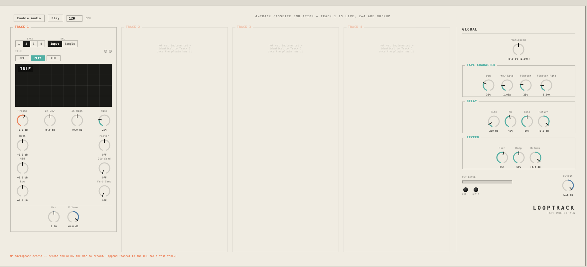

# Afrit

A 4-track tape machine plug-in. Record from your input into a 1–4 bar loop,
synced to host tempo so a tempo change truncates the loop rather than
smearing it. Wow/flutter and cassette hiss are real tape
character, not decoration — cents-correct pitch modulation, independently
rated from their depth. A global varispeed knob resamples the whole loop for
real pitch-and-speed-together tape behaviour. Each track carries an input
preamp with drive, a 3-band EQ, a DJ-style lo/hi filter, and two sends into a
shared lofi delay and reverb bus.

[Status](#status).



*The plug-in's own editor, rendered offscreen by `panel_shot`. The same
panel runs in the browser — see [Web prototype](#web-prototype).*

## Install

Download the latest build from
[Releases](https://github.com/SungamMagnus/afrit/releases), then copy
the plug-ins where your host looks for them:

```
VST3  ->  ~/Library/Audio/Plug-Ins/VST3/
AU    ->  ~/Library/Audio/Plug-Ins/Components/
```

### Clear the quarantine

A build you didn't compile yourself carries an ad-hoc signature, not an
Apple Developer ID. macOS flags anything downloaded from the internet as
quarantined, and Gatekeeper then refuses to load the plug-in — usually
**silently**, so it simply never appears in your host. Run this once after
installing:

```sh
xattr -dr com.apple.quarantine ~/Library/Audio/Plug-Ins/VST3/Afrit.vst3 ~/Library/Audio/Plug-Ins/Components/Afrit.component
```

Then restart your host and rescan. Building from source avoids this
altogether — a plug-in you compile yourself is never quarantined.

## How it works

- **Tempo sync**: the loop boundary is anchored to the host's musical
  position (PPQ), not a sample counter, so tempo ramps, locates, and
  stop/start all just work. A tempo increase mid-loop truncates the tail;
  a tempo decrease leaves silence until the next bar rather than wrapping
  early.
- **Record → loop → playback**: arm while the transport is stopped and
  recording starts the instant playback begins, no bar-boundary wait. Arm
  while already playing and it quantizes to the next bar — a standard
  punch-in.
- **Varispeed**: the global knob resamples the loop's own playback head, so
  pitch and speed move together like a real reel, not an independent
  pitch-shifter.
- **Signal chain**: input → 2-band shelf EQ → preamp (clean below 0dB,
  blends in tape-style drive above it) → the tape (record/loop) →
  wow/flutter → hiss → 3-band EQ → DJ filter → volume fader → pan → two
  sends into a shared lofi delay + 8-comb/4-allpass reverb bus.
- **Input monitoring**: the tape owns the output only while it is actually
  playing a loop back. Any other time — idle, armed, recording, or with PLAY
  off — the input passes straight through, so what you are about to record
  is always audible. The input stage (preamp, in-EQ, and its VU) greys out
  exactly when the tape takes over.

## Web prototype

`web/` is a real Web Audio implementation of Track 1 — not a mockup — in the
actual panel design. Native nodes do almost everything (EQ, wow/flutter via
a modulated delay line, the DJ filter, an 8-comb/4-allpass lofi reverb); one
`AudioWorkletProcessor` captures raw input into the loop buffer, since the
browser has no built-in "record this" primitive. The page runs its own
transport (no host in a browser), driving the same tempo-boundary math as
the plug-in.

```sh
cd web && python3 -m http.server 8777
```

Open <http://localhost:8777>, click **Enable Audio**, and allow microphone
access. See [`web/README.md`](web/README.md) for details and known
simplifications versus the plug-in.

## Build

Needs [JUCE](https://juce.com) 7 or later and CMake 3.22 or later.

```sh
cmake -S . -B build -DCMAKE_BUILD_TYPE=Release -DJUCE_DIR=/path/to/JUCE
cmake --build build -j8
```

`JUCE_DIR` defaults to `/Applications/JUCE`. The build copies the VST3, the
AU and the standalone into your user plug-in folders, and produces universal
(arm64 + x86_64) binaries on macOS.

### Dev tools

```sh
cmake -S . -B build -DCMAKE_BUILD_TYPE=Release -DAFRIT_TOOLS=ON
cmake --build build --target dsp_check panel_shot -j8

./build/dsp_check_artefacts/Release/dsp_check     # record/loop/varispeed correctness, headless
./build/panel_shot_artefacts/Release/panel_shot docs   # renders the editor offscreen
```

## Status

- ✅ Single track: record/loop, tempo sync + truncation, varispeed,
  wow/flutter, hiss, a boxed input stage (preamp + 2-band EQ + VU), 3-band
  EQ, DJ filter, shared lofi delay/reverb bus.
- ✅ The panel, in the plug-in and in the browser prototype.
- 📋 Tracks 2–4 — the architecture (shared mod-LFO phase, prefixed parameter
  IDs, a mono-summed FX bus) is already built for four tracks; only the
  replication is left.
